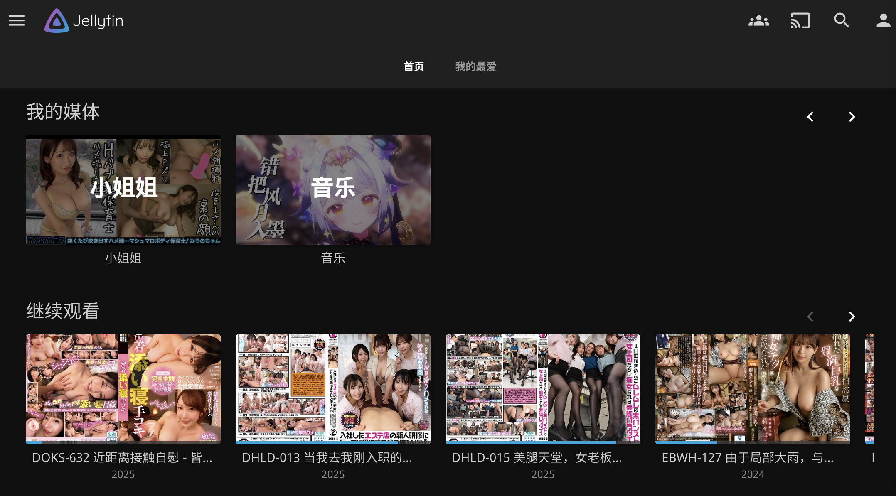

<div align="center">

<br>
  <!--  -->
</div>

<div align="center">
  
  
  
  
</div>

```
✨ 碎碎念

装好NAS后，本lsp心心念念想要搭建一个”学习资料“影视库，奈何现有的玩法都不太好用。第一是资料下载，磁力下载遇到老的资源就下不动了；二是元数据获取，之前尝试过metatube，但是时有抽风，说实话也不太好用。

最后我还是选择了从现有的网站下载，MissAV就是一个很好的选择。同时网站也提供了丰富的元数据，从网站解析下载链接的同时，可以获取到元数据；视频下载完成后，生成nfo，供媒体服务器使用。

⚠ PS：使用本项目最好要有稳定的代理！
```


## 核心特性

<table><tr>
  <td></td>
  <td></td>
  <td></td>
  <td></td>
</tr></table>

## 预览

媒体服务器使用Jellyfin：



## 快速开始

### 安装依赖
1. 安装Python3：Python 3.11.2
2. 安装Python依赖：`pip3 install -r requirements.txt`
3. 安装ffmpeg：`sudo apt install ffmpeg`
4. （arm需要，amd跳过）替换`tools/m3u8-Downloader-Go`，github上搜这个项目即可
5. （可选，后面启动api server需要。如果二进制兼容，可以直接用我编译好的server/main）安装golang：go version go1.22.6 linux/amd64

### 修改配置

配置结构：
```json
{
    "LogPath": "./logs",
    "SavePath": "/vol2/1000/MissAV",
    "DBPath": "./db/downloaded.db",
    "QueuePath": "./db/download_queue.txt",
    "MissAVDomain": "missav.ai",
    "proxy": "http://127.0.0.1:7897"
}
```
如果没有特殊需求，只需要关注如下字段：
1. SavePath：保存的路径，最好用绝对路径 -- pwd
2. proxy：http代理服务器，没有使用代理一般连不上MissAV。如果无需代理，配置成空串即可。

### 初始化项目

如果本地已经有老师了，需要先整理成如下结构：车牌号作为文件夹的名字，里面的视频名字和车牌号一致。

```bash
...
├── SVGAL-009
│   └── SVGAL-009.mp4
├── STCVS-007
│   └── STCVS-007.mp4
...
```
然后先执行`python3 metadata.py`，会搜索配置中的SavePath，给里面的每部片子都抓取元数据。同时把不在db中的车牌号保存到db中，保证后续的下载不会重复。

刮削后的结构：
```bash
...
├── SVGAL-009
│   ├── metadata.json
│   ├── SVGAL-009-fanart.jpg
│   ├── SVGAL-009.mp4
│   ├── SVGAL-009.nfo
│   └── SVGAL-009-poster.jpg
├── thumb
│   ├── JULIA.jpg
│   ├── ちゃんよた.jpg
│   ├── 七森莉莉.jpg
│   ├── 七泽米亚.jpg
...
```

### 测试下载

`python3 main.py SVGAL-009`

命令行会输出日志，如果使用crontab后台执行，可以观察日志输出：logs/2025-04-10.log。

如果不想校验db（如实现洗版），将第二个参数设置成-f即可强制下载。即执行 `python3 main.py SVGAL-009 -f`
但是最后还是会提示重复，是否覆盖。

### 自定义数据源优先级

在配置中定义了各个下载器的优先级，程序会根据权重从大到小，依次尝试使用对应下载器进行加载。如果想要禁用某个下载器，将对应的权重置为0。

```json
"Downloader": [
    {
        "downloaderName": "MissAV",
        "domain": "missav.ai",
        "weight": 150
    },
    {
        "downloaderName": "Jable",
        "domain": "jable.tv",
        "weight": 200
    },
    {
        "downloaderName": "HohoJ",
        "domain": "hohoj.tv",
        "weight": 250
    }
]
```

数据源说明：
1. MissAv：内容很全，无码破解优先，清晰度一般（720p-1080p），反爬没那么严格
2. Jable：内容很全，中文字幕优先，清晰度高（1080p），但是反爬比较严格
3. Hohoj：内容较全，中文字幕有限，清晰度高（1080p），基本没有反爬

综上，把Hohoj作为优先级最高的下载器，其次Jable，最后MissAV。元数据都从MissAV获取。

### 启动http服务

支持的下载方式：
1. 直接执行`python main.py <车牌号>`
2. 在db/download_queue.txt中按行增加要下载的车牌号，crontab定时执行cron_task.sh `20 * * * * cd /home/xxx/missav;bash cron_task.sh`，执行前最好cd到代码所在目录。

再提供第三个下载方式：远程控制

启动server/main后，往`http:127.0.0.1:49530/process`发送post请求，post体里面带上车牌号，即可开始下载；如果已经在下载了，则加到download_queue.txt中。

## 项目结构
```
MissAV/
├── cfg
│   └── configs.json
├── db
│   ├── downloaded.db // 保存已经下载的车牌号
│   └── download_queue.txt // 下载队列，执行cron_task.sh会取出最下面的车牌号，执行下载
├── logs
│   └── 2025-04-10.log // 日志，如果下载失败，到这里查原因
├── server // 简易web server，监听49530端口，获取post请求中的车牌号，调用main.py下载
│   ├── go.mod
│   ├── go.sum
│   ├── main
│   ├── main.go
│   └── README.md
├── src // 核心代码
│   ├── api.py
│   ├── comm.py
│   └── data.py
├── tools // m3u8下载器和一些其他的辅助脚本
│   ├── fix.py
│   ├── link.py
│   ├── m3u8-Downloader-Go
│   └── renamejpg.py
├── cron_task.sh // crontab使用，从download_queue.txt取出最后一个车牌号下载
├── main.py // 获取输入参数，执行下载、刮削、生成nfo的逻辑
├── metadata.py // 初始化项目时刮削已有视频的元数据
├── README.md
├── requirements.txt
└── work // 文件锁，保证同时只会执行一个下载。如果同时执行多个，会将后面的车牌号扔到download_queue.txt中
```

## 欢迎lsp们一起维护
