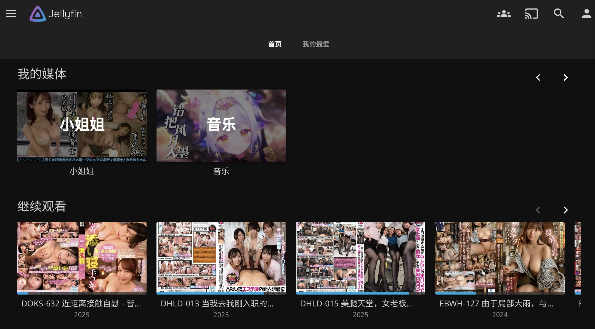

<div align="center">

<br>
</div>

<div align="center">
  
  
  
  
</div>

## 项目简介

NASSAV 是一个基于 Python 开发的多源影视资源下载管理工具，支持从多个数据源自动下载、整理和刮削影视资源。

项目采用模块化设计，支持自定义下载器，并提供了完整的元数据管理功能和配套服务。

## 核心特性

- 🎥 多源下载支持：支持 MissAV、Jable、HohoJ、Memo （持续添加中）等多个数据源
- 📝 智能元数据管理：从JavBus自动获取影片信息、封面、海报等元数据
- 🔄 队列管理：支持批量下载任务管理。使用sqlite去重，防止重复下载
- 🌐 远程控制：提供 HTTP API 接口，支持远程控制下载任务
- 🔒 文件锁机制：确保同一时间只有一个下载任务运行
- 🎨 媒体服务器兼容：自动生成 NFO 文件，支持主流媒体服务器

## Jellyfin预览



## 系统要求

- **稳定的网络连接和代理服务**
- Python 3.11.2 或更高版本
- FFmpeg
- Go 1.22.6 或更高版本（仅用于编译 HTTP 服务器）

## 安装指南

1. 克隆项目并安装依赖：
```bash
git clone https://github.com/Satoing/NASSAV.git
cd NASSAV
pip3 install -r requirements.txt
```

2. 安装 FFmpeg：
```bash
sudo apt install ffmpeg
```

3. 配置项目：
   - 复制 `cfg/configs.json.example` 为 `cfg/configs.json`
   - 修改配置文件中的关键参数：
     - `SavePath`：设置视频保存路径
     - `Proxy`：配置代理服务器地址（如果不需要使用代理，设置成""即可）
     - `Downloader`：配置下载器及其优先级
     - `IsNeedVideoProxy`：下载视频是否优先使用代理（最终都会尝试使用代理和不使用代理）
     - `Cloudflare`：MissAV 的浏览器 Cookie 与 User-Agent（见下文）

## 使用方法

### 基本使用

0. 初始化，修改配置文件。主要关注的字段：
    - SavePath：下载保存的位置
    - Proxy：http代理服务器url（如果不需要使用代理，设置成""即可）
    - IsNeedVideoProxy：下载视频是否使用代理
```json
{
    "LogPath": "./logs",
    "SavePath": "/vol2/1000/MissAV",
    "DBPath": "./db/downloaded.db",
    "QueuePath": "./db/download_queue.txt",
    "Proxy": "http://127.0.0.1:7897",
    "IsNeedVideoProxy": false,
}
```

1. 如果本地已有资源，需要先整理目录结构，车牌号大写作为文件夹名字，视频同名放在文件夹里面：

```
...
├── SVGAL-009
│   └── SVGAL-009.mp4
├── STCVS-007
│   └── STCVS-007.mp4
...
```
然后执行`python3 metadata.py`，爬取元数据。最后生成的目录结构：
```
...
├── SVGAL-009
│   ├── metadata.json
│   ├── SVGAL-009-fanart.jpg
│   ├── SVGAL-009.mp4
│   ├── SVGAL-009.nfo
│   └── SVGAL-009-poster.jpg
├── thumb
│   ├── JULIA.jpg
│   ├── ちゃんよた.jpg
│   ├── 七森莉莉.jpg
│   ├── 七泽米亚.jpg
...
```

2. 下载单个资源：
```bash
python3 main.py <车牌号>
```

3. 强制下载（忽略重复检查——下载过程中ctrl-c就会出现这种情况）：
```bash
python3 main.py <车牌号> -f
```

### 使用Docker下載

0. 前置作業如基本使用

1. Build Docker (初次使用才需要)
```bash
(sudo) docker build -t nassav .
```

2. 下載
```bash
(sudo) docker run --rm -v "<本機存片位置>:<cfg/configs.json裡設定的SavePath>" \
  -v "<missav-cookie.txt>:/NASSAV/missav-cookie.txt:ro" \
  nassav <車號>
```

使用cookie和UA可以bypass Cloudflare的防爬蟲，用額外掛載或在`cfg/configs.json`內填寫都可以，但頻率太高還是會被抓到進冷卻，為了解決這個問題有在docker image同時包進[flaresolverr](https://github.com/FlareSolverr/FlareSolverr)去解掉Cloudflare的驗證問題，從而實踐下載冷卻歸零。Bare-metal下載尚未測試。

若影片沒有fan art可在車號後加 `--no-fan-art`，例如 `docker run ... nassav <車號> --no-fan-art`。此參數會略過整個 `gen_nfo` 後處理，因此也不會產生 NFO；影片下載流程不變。

映像預設以 UID/GID `1000:1000` 執行，需對掛載的下載目錄有寫入權限。如果主機目錄屬於其他 UID/GID，建置時可加入 `--build-arg NASSAV_UID=$(id -u) --build-arg NASSAV_GID=$(id -g)`。

### 批量下载

1. 将车牌号添加到 `db/download_queue.txt` 中
2. 设置定时任务：
```bash
20 * * * * cd /path/to/NASSAV && bash cron_task.sh
```

### HTTP API 服务

1. 编译并启动 HTTP 服务器：
```bash
cd backend
go build -o main
./main
```

2. 发送下载请求：
```bash
curl -X POST http://127.0.0.1:49530/process -d "车牌号"
```

### 前后端服务

刮削时下载了大量fanart，故提供一个网页预览。

后端提供了两个API：
1. 获取车牌号列表：/api/videos
2. 获取车牌号详细信息：/api/videos/FPRE-017

请求结果如下：
```
/api/videos
-----------------------------
[{"id":"ACHJ-057","title":"ACHJ-057 時には勝手に痴女りたい…。Madonna専属 究極美熟女『めぐり』お貸ししますー。","poster":"/file/ACHJ-057/ACHJ-057-poster.jpg"},{"id":"ADN-604","title":"ADN-604 お義父さんは私の事、どう思ってますか？ 七海ティナ","poster":"/file/ADN-604/ADN-604-poster.jpg"},{"id":"AGAV-122","title":"AGAV-122 顔で抜く！！顔面ドアップPOV 関西弁でイチャサド射精管理してくる年上彼女との同棲生活 流川莉央","poster":"/file/AGAV-122/AGAV-122-poster.jpg"},...]

/api/videos/FPRE-017
-----------------------------
{"id":"FPRE-017","title":"FPRE-017 爆乳セレブ痴女に見つめられて犯●れたい 菊乃らん","releaseDate":"2024-02-02","fanarts":["/file/FPRE-017/FPRE-017-fanart-1.jpg","/file/FPRE-017/FPRE-017-fanart-10.jpg","/file/FPRE-017/FPRE-017-fanart-11.jpg","/file/FPRE-017/FPRE-017-fanart-12.jpg","/file/FPRE-017/FPRE-017-fanart-13.jpg","/file/FPRE-017/FPRE-017-fanart-14.jpg","/file/FPRE-017/FPRE-017-fanart-15.jpg","/file/FPRE-017/FPRE-017-fanart-16.jpg","/file/FPRE-017/FPRE-017-fanart-17.jpg","/file/FPRE-017/FPRE-017-fanart-18.jpg","/file/FPRE-017/FPRE-017-fanart-19.jpg","/file/FPRE-017/FPRE-017-fanart-2.jpg","/file/FPRE-017/FPRE-017-fanart-20.jpg","/file/FPRE-017/FPRE-017-fanart-21.jpg","/file/FPRE-017/FPRE-017-fanart-3.jpg","/file/FPRE-017/FPRE-017-fanart-4.jpg","/file/FPRE-017/FPRE-017-fanart-5.jpg","/file/FPRE-017/FPRE-017-fanart-6.jpg","/file/FPRE-017/FPRE-017-fanart-7.jpg","/file/FPRE-017/FPRE-017-fanart-8.jpg","/file/FPRE-017/FPRE-017-fanart-9.jpg","/file/FPRE-017/FPRE-017-fanart.jpg"],"videoFile":"/file/FPRE-017/FPRE-017.mp4"}
```

据此使用Vue实现一个前端，预览list和detail。

list页：

detail页：


前端部署方式：
1. 先调整`frontend/src/api/videos.js`中后端的配置：
```js
import axios from 'axios'
const API_BASE = 'http://192.168.31.61:31471' // 改成自己的ip
```
2. 重新生成静态文件到dist目录下：
```bash
cd frontend
npm run build
```
3. 使用nginx部署静态网页：`127.0.0.1:5177`

## 配置说明

### Cloudflare 验证

MissAV 请求可以在 `cfg/configs.json` 的 `Cloudflare` 项配置浏览器取得的 Cookie 和对应的 User-Agent：

```json
"Cloudflare": {
    "CookieFile": "missav-cookie.txt",
    "Cookie": "",
    "UserAgent": "",
    "Impersonate": "chrome120",
    "SolverURL": "http://127.0.0.1:8191/v1"
}
```

`CookieFile` 相对路径以项目目录为起点，文件第一行放完整的 Cookie 请求头值，第二行放同一个浏览器的 User-Agent。也可以留空 `CookieFile`，直接填写 `Cookie` 和 `UserAgent`；非空的直接设置会覆盖文件对应的值。`Impersonate` 是 `curl_cffi` 的浏览器指纹配置，应选择与取得 Cookie 的浏览器相近的类型。Cookie 只发送到配置的 MissAV 域名；从视频 CDN 下载播放清单和片段时只发送 Referer 与 User-Agent，不发送 Cookie。`cf_clearance` 等 Cookie 必须是真实且未过期的浏览器值，随意伪造无法通过 Cloudflare 验证。请勿将 Cookie 提交到版本控制。

Docker 映像内已包含 [FlareSolverr](https://github.com/FlareSolverr/FlareSolverr)，`SolverURL` 预设为 `http://127.0.0.1:8191/v1`。下载器只在 MissAV 页面收到挑战时调用浏览器服务，影片片段仍由原有下载流程处理。本机直接运行 `python3 main.py` 时，如需此功能，仍须另外启动 FlareSolverr；不需要时可把 `SolverURL` 设为空字串。

### JavBus 年齡／問卷驗證

JavBus 若將影片頁轉到 `doc/driver-verify`，需先在瀏覽器完成網站要求的驗證，再將同一瀏覽器對 `www.javbus.com` 的 Cookie 請求頭及 User-Agent，分別放入 `javbus-cookie.txt` 的第一、二行。於 `cfg/configs.json` 加入：

```json
"JavBus": {
    "CookieFile": "javbus-cookie.txt",
    "Cookie": "",
    "UserAgent": "",
    "Impersonate": "chrome120"
}
```

修改 `cfg/configs.json` 後需重建映像，或在執行時將設定檔掛載至 `/NASSAV/cfg/configs.json:ro`。Docker 執行時另加 `-v "$PWD/javbus-cookie.txt:/NASSAV/javbus-cookie.txt:ro"`；`CookieFile` 設為空字串時也可直接填 `Cookie`、`UserAgent`。Cookie 僅送往 `www.javbus.com`，不會送給外部圖片 CDN。JavBus 驗證需要有效的瀏覽器會話；FlareSolverr 只能處理其支援的瀏覽器挑戰，不會自動回答 JavBus 問卷。Cookie 過期時需重新在瀏覽器驗證並更新檔案，請勿將 Cookie 提交到版本控制或打包入映像。

### 下载器配置

在 `configs.json` 中可以配置多个下载源及其优先级：

```json
"Downloader": [
    {
        "downloaderName": "MissAV",
        "domain": "missav.ai",
        "weight": 300
    },
    {
        "downloaderName": "Jable",
        "domain": "jable.tv",
        "weight": 500
    },
    {
        "downloaderName": "HohoJ",
        "domain": "hohoj.tv",
        "weight": 0
    }
]
```

### 数据源说明

1. **MissAV**
   - 优点：资源全面，反爬限制较少
   - 缺点：清晰度一般（720p-1080p）

2. **Jable**
   - 优点：中文字幕资源多，清晰度高（1080p）
   - 缺点：反爬限制较严格

3. **HohoJ**
   - 优点：清晰度高（1080p），基本无反爬限制
   - 缺点：中文字幕资源较少

4. **Memo**
   - 优点：资源较新，更新及时
   - 缺点：部分资源需要会员


## 开发指南

### 添加新的下载器

1. 在 `src/downloader/` 目录下创建新的下载器类
2. 继承 `Downloader` 基类，实现必要的方法：
   - `getDownloaderName()`
   - `getHTML()`
   - `parseHTML()`
3. 在 `DownloaderMgr` 中注册新下载器
4. 在配置文件中添加相应的配置项

示例代码：
```python
class NewDownloader(Downloader):
    def getDownloaderName(self) -> str:
        return "NewDownloader"

    def getHTML(self, avid: str) -> Optional[str]:
        # 实现获取HTML的逻辑
        pass

    def parseHTML(self, html: str) -> Optional[AVDownloadInfo]:
        # 实现解析HTML的逻辑
        pass
```
### 有需求请自行fork修改，如果想要贡献代码发起PR即可


## 注意事项

- 使用本项目需要稳定的代理服务
- 请遵守相关法律法规，合理使用本工具
- 建议定期备份数据库文件
- 下载过程中请确保网络稳定
- 下载频率不要过高。否则会被cloudflare安排进贤者时间

## 许可证

本项目采用 MIT 许可证。详见 [LICENSE](LICENSE) 文件。
